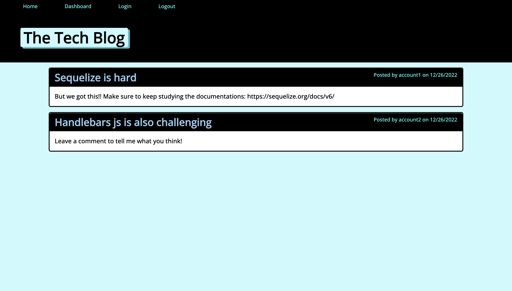
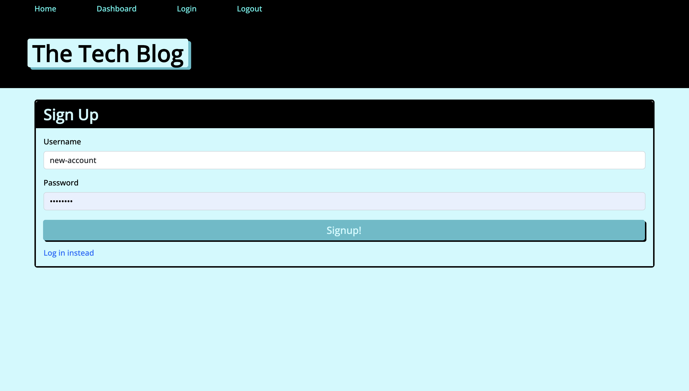
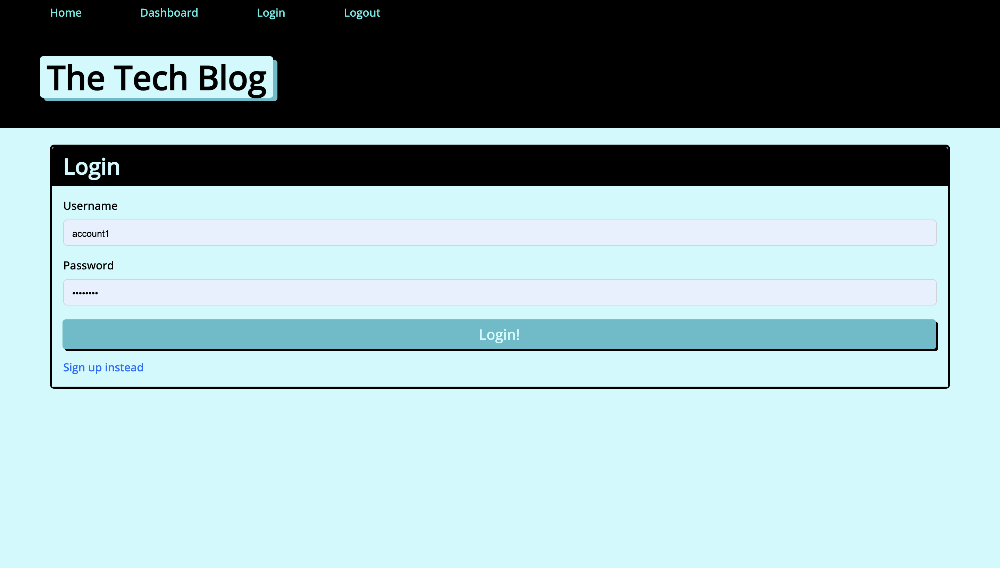
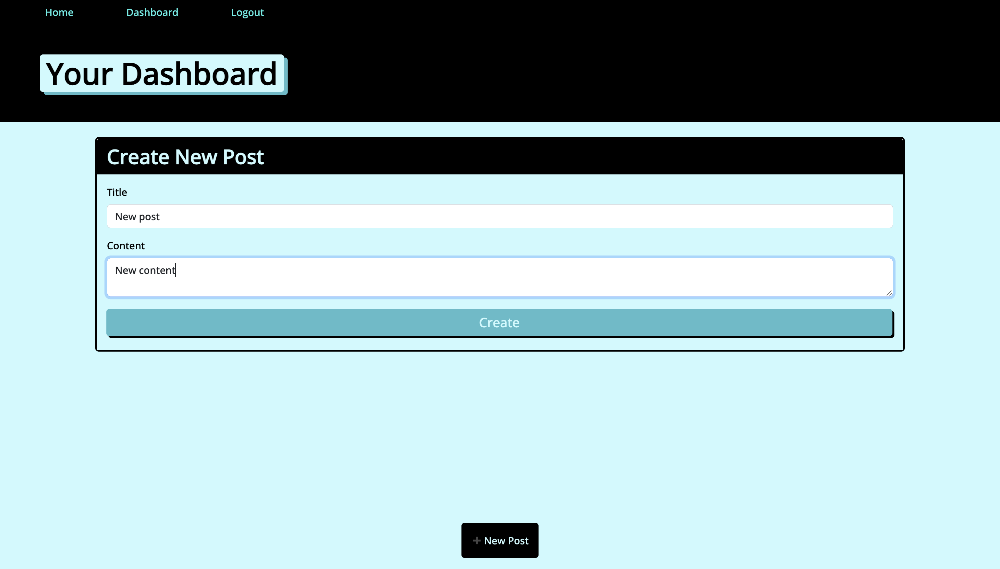
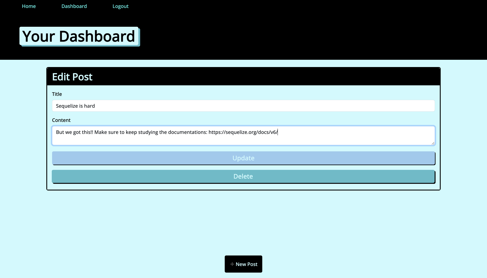
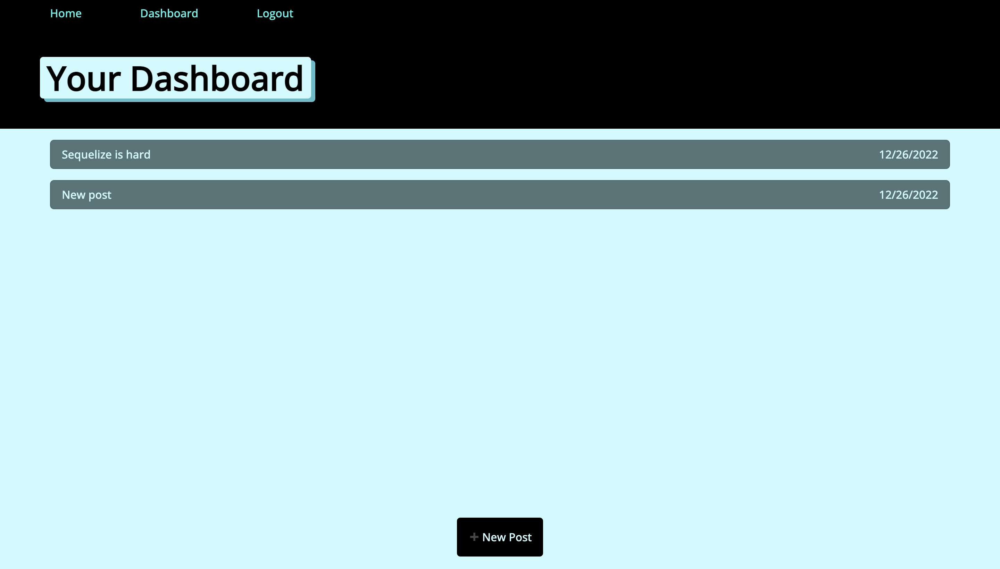
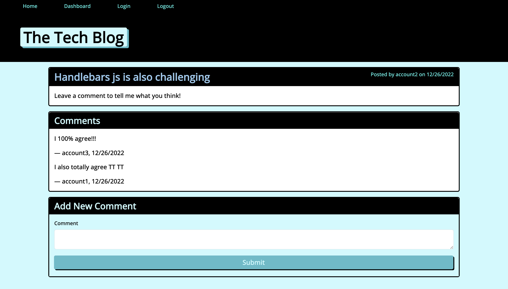

# Tech Blog
## Description

This CMS-style blog is built for developers to publish their blog posts and comment on other developers’ posts as well.

## Table of Content

* [Installation](#installation)

* [Usage](#usage)

* [Contributing](#contributing)

* [Questions](#questions)   

## Installation

To install all necessary dependencies for development purposes, please run the command below:  

``npm i express``  

``npm run start``

## Usage

To use this application, open the Note Taker by going to [https://shrouded-falls-58011.herokuapp.com/](https://shrouded-falls-58011.herokuapp.com/). Anyone can view existing blog posts on the homepage without signing up or logging in. But to make your own blog posts or leave a comment, you must sign up and log in. To do so, on the navbar at the top, click on Dashboard or Login to sign up with a username and password and log in. Then, make a post from your Dashboard by filling out the title and content. You can also edit or delete blog posts by clicking on them from your dashboard. All blog posts that you make will appear on your dashboard. To leave comments on other users' blog posts, go to Home and click on each individual blog posts to view post, look at the comment thread, and leave your own comment. If you are idle on the site for more than a set time, you will still be able to view comments but must log in again before you can add, update, or delete comments and blog posts.

 
  

  

  

  

  

  

  

## Contributing

There are many ways in which you can participate in this project.
Users can contribute to this repo by submitting bugs and feature requests, reviewing source code changes, and making pull requests for any issues they can find.    

## Questions

For any questions or feedback, please feel free to email me at nbtrieu@uci.edu.
If you would like to check out more of my projects, please visit [nbtrieu](https://github.com/nbtrieu).
